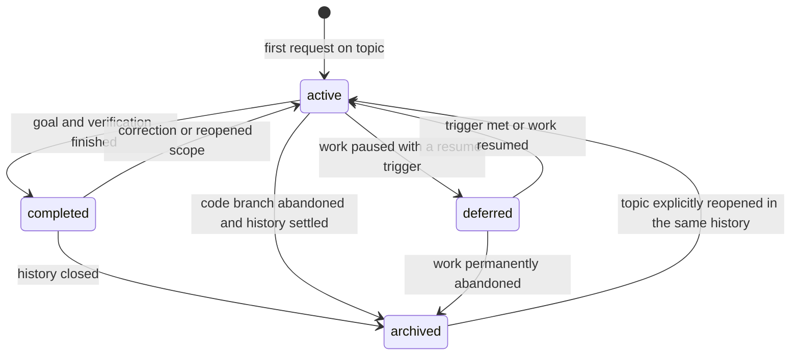

# Record lifecycle and ownership

When history capture is configured, the work-item tree is its continuity
anchor under the project's capture policy. One root records the user's topic;
independently delegated tasks can have children with `parent_work_item_id`
pointing upward. Timelines retain chronological events; current state and next
action change with facts. Generated `tree` supplies navigation without parent
backlinks. Specialized records need their registered creation condition and
actual purpose. Formal-spec and research workflows retain their native schemas.
Child graph relations record history, not transfer of work responsibility.
Assignment DONE, criterion outcomes, review dispositions, commit success, and
work-item completion remain distinct. Keep required unresolved work active or
deferred and preserve it across ownership transfers.

| Type | States | Transition evidence |
| --- | --- | --- |
| `work-item` | `active`, `deferred`, `completed`, `archived` | Capture dated events under project policy. Record result, blocker or resume trigger, code SHA, links, and next action. Settle required children and finalization before closing a parent. Archive retains history; it does not mean a claim is deprecated. |
| `decision` | `pending`, `adopted`, `rejected`, `archived` | A material choice moves from options to a dated decision with decision maker, rationale, consequences, and confirmation. Rejection keeps its reason. Archive when superseded or only historically relevant, with replacement link. |
| `design` | `draft`, `adopted`, `archived` | Internal design is adopted after its approach and risks are agreed. Archive with a replacement link if superseded. OpenSpec owns design for its own change. |
| `plan` | `active`, `deferred`, `completed`, `archived` | Tasks and checks drive progress; defer with dependency, complete after evidence, archive once historical. OpenSpec tasks govern OpenSpec changes. |
| `tdd` | `active`, `completed`, `archived` | Create for an actual warranted TDD cycle. Complete after observed RED/GREEN, any needed refactoring or its omission reason, and covering verification are linked. Archive with history; ordinary verification needs no TDD record. |
| `reference-note` | `current`, `archived` | Current means supported for its stated validity scope. Recheck on its trigger. Archive when the source or conclusion is superseded; link the replacement and preserve the old evidence. |
| `weekly-report` | `draft`, `final` | Final means the requested period was verified against its sources. Re-run the same week in the same file. Correct a past final report with a dated entry in `Corrections` and updated `as_of`; do not silently replace its history. |

## Cross-owner transitions

1. Under configured capture, a request updates its root/child work item. Discovery uses generated `list` and `tree`; weekly aggregation uses `events --week`. Add specialized records only when their condition and purpose apply.
2. Read the project's governing behavior contract. When OpenSpec owns it, write changed requirements/scenarios through its CLI-selected workflow and verify against that contract. Link the working spec's necessary derivations, governing criteria, active tasks, and evidence without creating a rival spec or second active plan/controller.
3. A research experiment uses research-skills' configured root and template. Its protocol and evidence stay in that record; the work item links it and records the discussion or decision.
4. Git performs authorized integration and reports the actual target/SHA and checks. Forward remaining contract sync/archive to the formal owner when applicable; reuse completed transitions. Reconcile requirements, review outcomes, evidence, blockers, and required finalization before completing/archiving history.
5. On abandonment, record the last SHA and reason, preserve useful evidence, and settle domain artifacts through their owners without adopting unaccepted requirements. Work-item archival retains history. Git resource cleanup and temporary domain-record disposal remain separate decisions.
6. A weekly report is created only on manual request from events in the Asia/Seoul Monday-to-Monday interval and linked authoritative sources. It is a summary, never a second source of truth.
