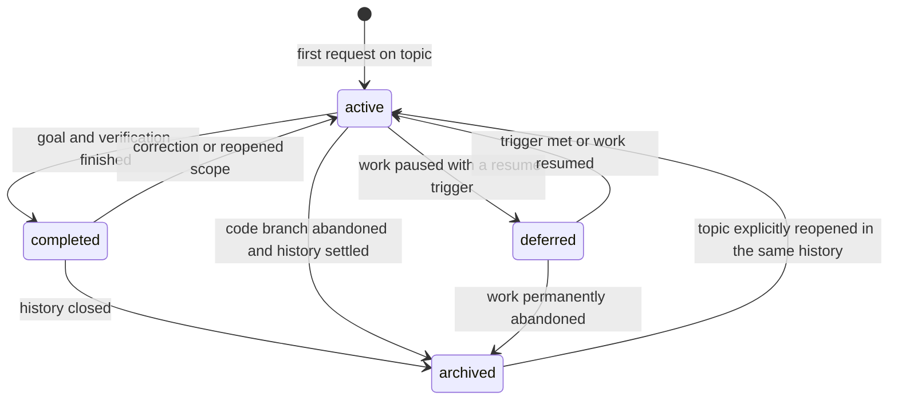

# Record lifecycle and ownership

The work-item tree is the continuity anchor for every request and discussion. One root records the user's topic; independently delegated tasks have child work items with `parent_work_item_id` pointing upward. Each node's timeline is append-only and chronological; its current state and next action are revised as facts change. The parent need not be edited when a child is added, and generated `tree` output supplies navigation. Other records are created only by their `create_when` rule and linked from their owning node. OpenSpec and research experiments keep their own native schemas.

| Type | States | Transition evidence |
| --- | --- | --- |
| `work-item` | `active`, `deferred`, `completed`, `archived` | Every request/discussion gets a dated event in its owning node. Record result, blocker or resume trigger, code SHA, links, and next action. Settle required children before closing a parent. Archive retains history; it does not mean a claim is deprecated. |
| `decision` | `pending`, `adopted`, `rejected`, `archived` | A material choice moves from options to a dated decision with decision maker, rationale, consequences, and confirmation. Rejection keeps its reason. Archive when superseded or only historically relevant, with replacement link. |
| `design` | `draft`, `adopted`, `archived` | Internal design is adopted after its approach and risks are agreed. Archive with a replacement link if superseded. OpenSpec owns design for its own change. |
| `plan` | `active`, `deferred`, `completed`, `archived` | Tasks and checks drive progress; defer with dependency, complete after evidence, archive once historical. OpenSpec tasks govern OpenSpec changes. |
| `tdd` | `active`, `completed`, `archived` | Complete after the observed RED/GREEN/REFACTOR and final verification evidence is linked. Archive with the work history. |
| `reference-note` | `current`, `archived` | Current means supported for its stated validity scope. Recheck on its trigger. Archive when the source or conclusion is superseded; link the replacement and preserve the old evidence. |
| `weekly-report` | `draft`, `final` | Final means the requested period was verified against its sources. Re-run the same week in the same file. Correct a past final report with a dated entry in `Corrections` and updated `as_of`; do not silently replace its history. |

## Cross-owner transitions

1. A user request begins or updates the root work item; an independent delegated task uses its own child. Discovery uses generated `list` and `tree`; weekly aggregation uses `events --week` across all nodes. A specialized local record is added only if its registered creation condition holds.
2. A product behavior change reads the OpenSpec main spec, then writes delta requirements and testable scenarios in the CLI-selected change. Implementation and tests are checked against that contract. The work item links the change and code SHA; local `design`/`plan` do not duplicate it.
3. A research experiment uses research-skills' configured root and template. Its protocol and evidence stay in that record; the work item links it and records the discussion or decision.
4. On code branch merge, verify actual merged SHA, implementation, tests, and delta specs. Sync adopted requirements to OpenSpec main specs, validate, and archive the change. Complete or archive the work item after recording the result.
5. On code branch abandonment, record the last SHA and reason. Preserve discussion and experiment evidence, archive the change without syncing unadopted requirements, then archive the work item. No document branch is created.
6. A weekly report is created only on manual request from events in the Asia/Seoul Monday-to-Monday interval and linked authoritative sources. It is a summary, never a second source of truth.
